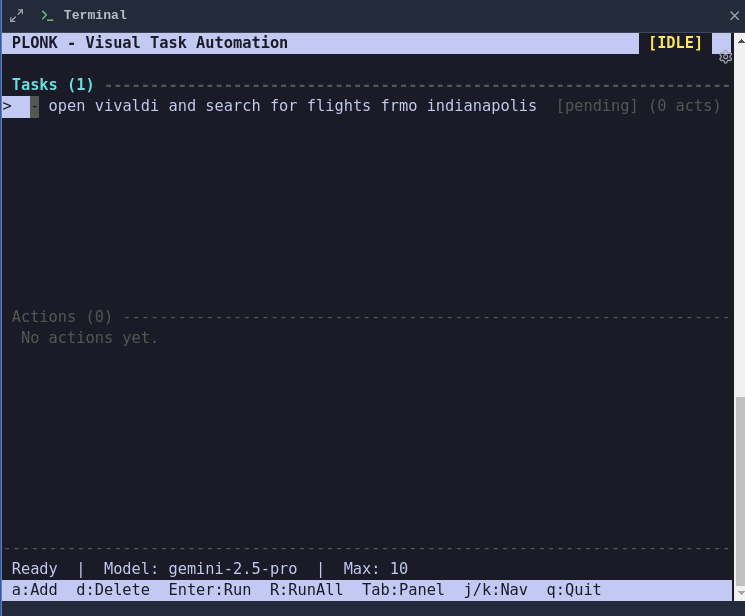
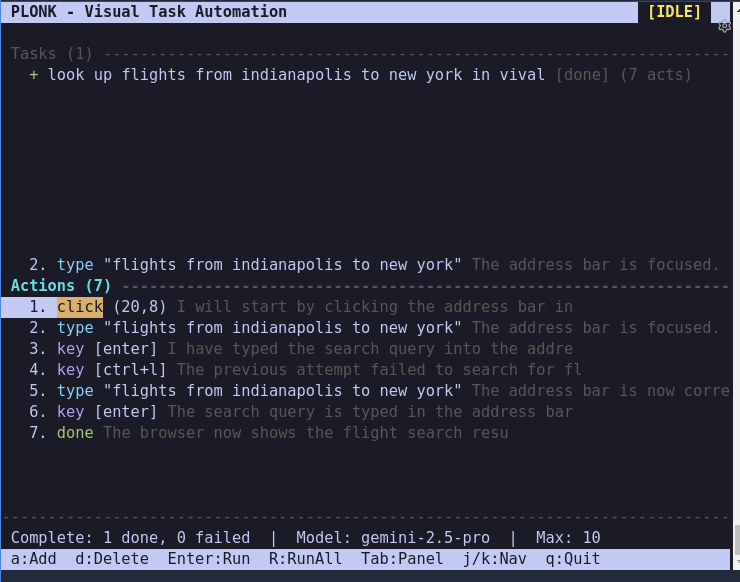
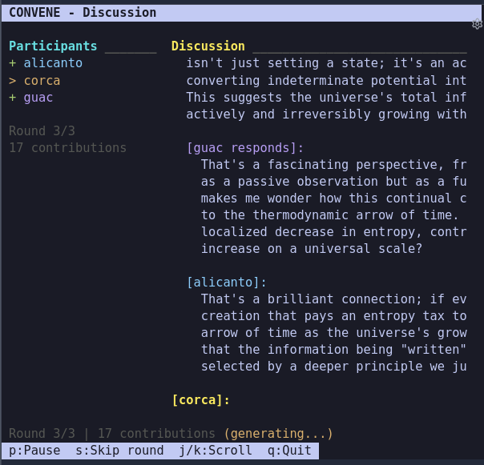

<p align="center">
  <a href="https://github.com/npc-worldwide/npcsh/blob/main/docs/npcsh.md">
  </a>
</p>

<h1 align="center">npcsh</h1>

<p align="center">
  <strong>The agentic shell for building and running AI teams from the command line.</strong>
</p>

<p align="center">
  <a href="https://github.com/npc-worldwide/npcsh/blob/main/LICENSE"></a>
  <a href="https://pypi.org/project/npcsh/"></a>
  <a href="https://pypi.org/project/npcsh/"></a>
  <a href="https://npc-shell.readthedocs.io/"></a>
</p>

---

`npcsh` makes the most of multi-modal LLMs and agents through slash commands and interactive modes, all from the command line. Build teams of agents, schedule them on jobs, engineer context, and design custom Jinja Execution templates (Jinxes) for you and your agents to invoke.

```bash
pip install 'npcsh[lite]'
```

Once installed, run `npcsh` to enter the NPC shell. Also provides the CLI tools `npc`, `wander`, `spool`, `yap`, and `nql`.

`.npc` and `.jinx` files are directly executable with shebangs (`#!/usr/bin/env npc`):
```bash
npc ./myagent.npc "summarize this repo"     # run an NPC with a prompt
npc ./script.jinx bash_command="ls -la"     # run a jinx directly
./myagent.npc "hello"                       # or just execute it (with shebang)
```

---

## Benchmark Results

How well can a model drive `npcsh` as an agentic shell? 125 tasks across 15 categories — from basic shell commands to multi-step workflows, code debugging, and tool chaining — scored pass/fail. Comparisons with other agent coders coming soon.

<table>
<tr><th>Family</th><th>Model</th><th>Score</th></tr>
<tr><td rowspan="5"><b>Qwen3.5</b></td><td>0.8b</td><td>31/125 (24%)</td></tr>
<tr><td>2b</td><td>81/125 (65%)</td></tr>
<tr><td>4b</td><td>77/125 (62%)</td></tr>
<tr><td>9b</td><td><b>100/125 (80%)</b></td></tr>
<tr><td>35b</td><td><b>111/125 (88%)</b></td></tr>
<tr><td rowspan="5"><b>Qwen3</b></td><td>0.6b</td><td>—</td></tr>
<tr><td>1.7b</td><td>42/125 (34%)</td></tr>
<tr><td>4b</td><td><b>94/125 (75%)</b></td></tr>
<tr><td>8b</td><td>85/125 (68%)</td></tr>
<tr><td>30b</td><td><b>103/125 (82%)</b></td></tr>
<tr><td rowspan="4"><b>Gemma3</b></td><td>1b</td><td>—</td></tr>
<tr><td>4b</td><td>37/125 (30%)</td></tr>
<tr><td>12b</td><td>77/125 (62%)</td></tr>
<tr><td>27b</td><td>73/125 (58%)</td></tr>
<tr><td rowspan="3"><b>Llama</b></td><td>3.2:1b</td><td>—</td></tr>
<tr><td>3.2:3b</td><td>26/125 (20%)</td></tr>
<tr><td>3.1:8b</td><td>60/125 (48%)</td></tr>
<tr><td rowspan="2"><b>Mistral</b></td><td>small3.2</td><td>72/125 (57%)</td></tr>
<tr><td>ministral-3</td><td>51/125 (40%)</td></tr>
<tr><td><b>Phi</b></td><td>phi4</td><td>58/125 (46%)</td></tr>
<tr><td><b>GPT-OSS</b></td><td>20b</td><td>94/125 (75%)</td></tr>
<tr><td rowspan="2"><b>OLMo2</b></td><td>7b</td><td>13/125 (10%)</td></tr>
<tr><td>13b</td><td>47/125 (38%)</td></tr>
<tr><td><b>Cogito</b></td><td>3b</td><td>10/125 (8%)</td></tr>
<tr><td><b>GLM</b></td><td>4.7-flash</td><td><b>102/125 (82%)</b></td></tr>
<tr><td rowspan="3"><b>Gemini</b></td><td>2.5-flash</td><td>—</td></tr>
<tr><td>3.1-flash</td><td>—</td></tr>
<tr><td>3.1-pro</td><td>—</td></tr>
<tr><td rowspan="2"><b>Claude</b></td><td>4.6-sonnet</td><td>—</td></tr>
<tr><td>4.5-haiku</td><td>—</td></tr>
<tr><td><b>GPT</b></td><td>5-mini</td><td>—</td></tr>
<tr><td rowspan="2"><b>DeepSeek</b></td><td>chat</td><td>—</td></tr>
<tr><td>reasoner</td><td>—</td></tr>
</table>

<details><summary><b>Category breakdown (completed models)</b></summary>

<table>
<tr>
<th rowspan="2">Category</th>
<th colspan="4">Qwen3.5</th>
<th colspan="5">Qwen3</th>
<th colspan="3">Gemma3</th>
<th>Llama</th>
<th colspan="2">Mistral</th>
<th>Phi</th>
<th>GPT-OSS</th>
<th>Cogito</th>
<th>GLM</th>
</tr>
<tr>
<th>0.8b</th><th>2b</th><th>9b</th><th>35b</th>
<th>1.7b</th><th>4b</th><th>8b</th><th>30b</th><th>0.6b</th>
<th>4b</th><th>12b</th><th>27b</th>
<th>3.2:3b</th>
<th>small3.2</th><th>ministral-3</th>
<th>phi4</th>
<th>20b</th>
<th>3b</th>
<th>4.7-flash</th>
</tr>
<tr><td>shell (10)</td><td>5</td><td>6</td><td>10</td><td>10</td><td>8</td><td>8</td><td>9</td><td>9</td><td>—</td><td>6</td><td>6</td><td>9</td><td>6</td><td>10</td><td>7</td><td>9</td><td>10</td><td>0</td><td>10</td></tr>
<tr><td>file-ops (10)</td><td>8</td><td>9</td><td>10</td><td>10</td><td>8</td><td>10</td><td>9</td><td>10</td><td>—</td><td>6</td><td>9</td><td>10</td><td>2</td><td>6</td><td>10</td><td>10</td><td>10</td><td>0</td><td>10</td></tr>
<tr><td>python (10)</td><td>0</td><td>3</td><td>9</td><td>10</td><td>0</td><td>5</td><td>6</td><td>6</td><td>—</td><td>0</td><td>3</td><td>1</td><td>0</td><td>3</td><td>6</td><td>4</td><td>10</td><td>0</td><td>10</td></tr>
<tr><td>data (10)</td><td>0</td><td>2</td><td>4</td><td>6</td><td>2</td><td>4</td><td>5</td><td>6</td><td>—</td><td>1</td><td>5</td><td>7</td><td>0</td><td>5</td><td>9</td><td>4</td><td>6</td><td>0</td><td>5</td></tr>
<tr><td>system (10)</td><td>2</td><td>8</td><td>9</td><td>10</td><td>7</td><td>9</td><td>7</td><td>10</td><td>—</td><td>5</td><td>9</td><td>7</td><td>2</td><td>9</td><td>6</td><td>6</td><td>9</td><td>0</td><td>10</td></tr>
<tr><td>text (10)</td><td>1</td><td>7</td><td>6</td><td>8</td><td>2</td><td>10</td><td>6</td><td>7</td><td>—</td><td>3</td><td>9</td><td>8</td><td>1</td><td>7</td><td>0</td><td>4</td><td>8</td><td>0</td><td>7</td></tr>
<tr><td>debug (10)</td><td>2</td><td>6</td><td>10</td><td>10</td><td>0</td><td>4</td><td>2</td><td>10</td><td>—</td><td>0</td><td>3</td><td>0</td><td>0</td><td>4</td><td>0</td><td>0</td><td>9</td><td>0</td><td>9</td></tr>
<tr><td>git (10)</td><td>0</td><td>8</td><td>6</td><td>9</td><td>2</td><td>9</td><td>9</td><td>8</td><td>—</td><td>4</td><td>6</td><td>9</td><td>4</td><td>8</td><td>4</td><td>6</td><td>8</td><td>0</td><td>5</td></tr>
<tr><td>multi-step (10)</td><td>0</td><td>6</td><td>7</td><td>6</td><td>0</td><td>6</td><td>3</td><td>7</td><td>—</td><td>3</td><td>5</td><td>5</td><td>2</td><td>3</td><td>0</td><td>5</td><td>4</td><td>0</td><td>5</td></tr>
<tr><td>scripting (10)</td><td>1</td><td>5</td><td>8</td><td>10</td><td>0</td><td>7</td><td>2</td><td>6</td><td>—</td><td>0</td><td>2</td><td>1</td><td>0</td><td>3</td><td>1</td><td>3</td><td>7</td><td>0</td><td>8</td></tr>
<tr><td>image-gen (5)</td><td>5</td><td>5</td><td>5</td><td>5</td><td>5</td><td>5</td><td>5</td><td>5</td><td>—</td><td>3</td><td>5</td><td>3</td><td>5</td><td>5</td><td>1</td><td>2</td><td>5</td><td>5</td><td>5</td></tr>
<tr><td>audio-gen (5)</td><td>5</td><td>4</td><td>5</td><td>5</td><td>5</td><td>5</td><td>5</td><td>5</td><td>—</td><td>4</td><td>5</td><td>5</td><td>4</td><td>5</td><td>1</td><td>5</td><td>5</td><td>5</td><td>5</td></tr>
<tr><td>web-search (5)</td><td>1</td><td>5</td><td>4</td><td>5</td><td>1</td><td>5</td><td>4</td><td>5</td><td>—</td><td>1</td><td>5</td><td>5</td><td>0</td><td>4</td><td>5</td><td>0</td><td>3</td><td>0</td><td>5</td></tr>
<tr><td>delegation (5)</td><td>0</td><td>2</td><td>3</td><td>3</td><td>0</td><td>2</td><td>2</td><td>4</td><td>—</td><td>0</td><td>2</td><td>0</td><td>0</td><td>0</td><td>0</td><td>0</td><td>0</td><td>0</td><td>3</td></tr>
<tr><td>tool-chain (5)</td><td>1</td><td>5</td><td>4</td><td>4</td><td>2</td><td>5</td><td>2</td><td>5</td><td>—</td><td>1</td><td>3</td><td>3</td><td>0</td><td>0</td><td>1</td><td>0</td><td>0</td><td>0</td><td>5</td></tr>
<tr><td><b>Total (125)</b></td><td><b>31</b></td><td><b>81</b></td><td><b>100</b></td><td><b>111</b></td><td><b>42</b></td><td><b>94</b></td><td><b>76</b></td><td><b>103</b></td><td>—</td><td><b>37</b></td><td><b>77</b></td><td><b>73</b></td><td><b>26</b></td><td><b>72</b></td><td><b>51</b></td><td><b>58</b></td><td><b>94</b></td><td><b>10</b></td><td><b>102</b></td></tr>
</table>

</details>

```bash
python -m npcsh.benchmark.local_runner --model qwen3:4b --provider ollama
```

---

## Usage

- Get help with a task:
    ```bash
    npcsh>can you help me identify what process is listening on port 5337?
    ```

- Edit files:
    ```bash
    npcsh>please read through the markdown files in the docs folder and suggest changes
    ```

- **Search & Knowledge**
  ```bash
  /web_search "cerulean city"            # Web search
  /db_search "query"                     # Database search
  /file_search "pattern"                 # File search
  /memories                              # Interactive memory browser TUI
  /kg                                    # Interactive knowledge graph TUI
  /nql                                   # Database query TUI
  ```
  <p align="center">
      
  </p>

- **Computer Use**
  ```bash
  /computer_use
  ```
  <p align="center">
      
      
  </p>

- **Generate Images**
  ```bash
  /vixynt 'generate an image of a rabbit eating ham in the brink of dawn' model='gpt-image-1' provider='openai'
  ```
  <p align="center">
    
  </p>

- **Generate Videos**
  ```bash
  /roll 'generate a video of a hat riding a dog' veo-3.1-fast-generate-preview  gemini
  ```
  <p align="center">
    
  </p>

- **Multi-Agent Discussions**
  ```bash
  /convene "Is the universe a simulation?" npcs=alicanto,corca,guac rounds=3
  ```
  <p align="center">
      
  </p>

- **Serve an NPC Team**
  ```bash
  /serve --port 5337 --cors='http://localhost:5137/'
  ```

---

## Features

- **[Agents (NPCs)](https://npc-shell.readthedocs.io/en/latest/guide/#working-with-npcs-agents)** — AI agents with personas, directives, and tool sets
- **[Team Orchestration](https://npc-shell.readthedocs.io/en/latest/guide/#team-orchestration)** — Delegation, review loops, multi-NPC discussions
- **[Jinxes](https://npc-shell.readthedocs.io/en/latest/guide/#all-commands)** — Jinja Execution templates — reusable tools for users and agents
- **[Skills](https://npc-shell.readthedocs.io/en/latest/guide/#skills-knowledge-content-for-agents)** — Knowledge-content jinxes with progressive section disclosure
- **[NQL](https://npc-shell.readthedocs.io/en/latest/guide/#nql---sql-models-with-ai-functions)** — SQL models with embedded AI functions (Snowflake, BigQuery, Databricks, SQLite)
- **[Knowledge Graphs](https://npc-shell.readthedocs.io/en/latest/guide/#memory--knowledge-graph)** — Build and evolve knowledge graphs from conversations
- **[Deep Research](https://npc-shell.readthedocs.io/en/latest/guide/#deep-research)** — Multi-agent hypothesis generation, persona sub-agents, paper writing
- **[Computer Use](https://npc-shell.readthedocs.io/en/latest/guide/#all-commands)** — GUI automation with vision
- **[Image, Audio & Video](https://npc-shell.readthedocs.io/en/latest/guide/#all-commands)** — Generation via Ollama, diffusers, OpenAI, Gemini
- **[MCP Integration](https://npc-shell.readthedocs.io/en/latest/guide/#all-commands)** — Full MCP server support with agentic shell TUI
- **[API Server](https://npc-shell.readthedocs.io/en/latest/guide/#serving-an-npc-team)** — Serve teams via OpenAI-compatible REST API

Works with all major LLM providers through LiteLLM: `ollama`, `openai`, `anthropic`, `gemini`, `deepseek`, `openai-like`, and more.

---

## Installation

```bash
pip install 'npcsh[lite]'        # API providers (ollama, gemini, anthropic, openai, etc.)
pip install 'npcsh[local]'       # Local models (diffusers/transformers/torch)
pip install 'npcsh[yap]'         # Voice mode
pip install 'npcsh[all]'         # Everything
```

<details><summary>System dependencies</summary>

**Linux:**
```bash
sudo apt-get install espeak portaudio19-dev python3-pyaudio ffmpeg libcairo2-dev libgirepository1.0-dev
curl -fsSL https://ollama.com/install.sh | sh
ollama pull qwen3.5:2b
```

**macOS:**
```bash
brew install portaudio ffmpeg pygobject3 ollama
brew services start ollama
ollama pull qwen3.5:2b
```

**Windows:** Install [Ollama](https://ollama.com) and [ffmpeg](https://ffmpeg.org), then `ollama pull qwen3.5:2b`.

</details>

API keys go in a `.env` file:
```bash
export OPENAI_API_KEY="your_key"
export ANTHROPIC_API_KEY="your_key"
export GEMINI_API_KEY="your_key"
```

### Rust Edition (experimental)

A native Rust build of `npcsh` is available — same shell, same DB, same team files, faster startup. Still experimental.

```bash
cd npcsh/rust && cargo build --release
cp target/release/npcsh ~/.local/bin/npc   # or wherever you want
```

Both editions share `~/npcsh_history.db` and `~/.npcsh/npc_team/` and can be used interchangeably.

## Read the Docs

Full documentation, guides, and API reference at [npc-shell.readthedocs.io](https://npc-shell.readthedocs.io/en/latest/).

## Links

- **[npcpy](https://github.com/cagostino/npcpy)** — Python framework for building AI agents and teams
- **[Incognide](https://github.com/npc-worldwide/incognide)** — Desktop workspace for the NPC Toolkit ([download](https://enpisi.com/incognide))
- **[Newsletter](https://forms.gle/n1NzQmwjsV4xv1B2A)** — Stay in the loop

## Research

- Quantum-like nature of natural language interpretation: [arxiv](https://arxiv.org/abs/2506.10077), accepted at [QNLP 2025](https://qnlp.ai)
- Simulating hormonal cycles for AI: [arxiv](https://arxiv.org/abs/2508.11829)

## Community & Support

[Discord](https://discord.gg/VvYVT5YC) | [Monthly donation](https://buymeacoffee.com/npcworldwide) | [Merch](https://enpisi.com/shop) | Consulting: info@npcworldwi.de

## Contributing

Contributions welcome! Submit issues and pull requests on the [GitHub repository](https://github.com/npc-worldwide/npcsh).

## License

MIT License.

## Star History

[](https://star-history.com/#npc-worldwide/npcsh&Date)
